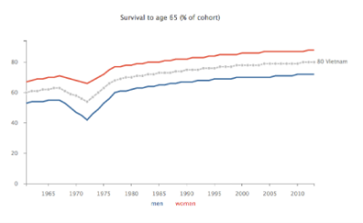

## The worldbank data interface

###### A display of the world's economic, social and health development over the past 50 years 

---

1. [Data] (#the-data)
2. [Objectives] (#the-objectives)
3. [Visual] (#the-visual)

---

####  The data

The worldbank data interface used to be a dashboard I built for a broadcasting company some time ago. One of the key objectives was to compare metrics of a large number of brands from two product lines (on-demand vs. traditional television) with each other. All metrics required to be shown as a time-series. When I decided to publish the dashboard I needed to find open data to replace the proprietary data. It wasn't a long search as I wanted to work with [Worldbank data](http://databank.worldbank.org/data/reports.aspx?source=world-development-indicators) for some time as it's such a relevant and deep data-source showing trends over a comparably long time-period. Starting to wrangle the data it became apparent quite quickly that the worldbank data shared key properties with my original dataset:

* It's time-series data
* for a large number of categories (ie. countries).
* There are enough metrics and
* the metrics can be roughly clustered into a small number of categories.

and most importantly:

* The categories (= countries) themselves can be clustered into a super-category to allow comparison.

In the case of the original interface this super-category was the *broadcasting type* (on-demnad vs. traditional television). For the worldbank data I could use the [*Human Development Index*](https://en.wikipedia.org/wiki/Human_Development_Index). The Human Development Index (or HDI) is colloquially well-known as we tend to refer to *highly developed* countries or countries with a *low development*. In fact the HDI establishes a grouping with 4 ordinal categories of development:

1. Very high 
2. High
3. Medium and 
4. Low

--

#### The objectives

As mentioned above the rather general objective for this project was to allow an intuitive comparison between the key values. After further discussions, these could be specified to the following specific objectives:

1. show trends 
2. show hierarchies
3. allow comparison on individual category level (ie. countries)
4. allow comparison on super-category level (ie. development level of countries)
5. allow an easy lookup of indiviudal categories (= countries)
6. summarise the values per category (= country)
7. show associations between selected metrics - ideally over time 

--

#### The visual 

After some pondering and sketching I went for one central visual holding the main data corpus and ticking in fact the first 5 of above boxes. Why stick so many objectives into one visual? In this case it was just most efficient. The user doesn't have to move between different idioms while still being able to apply a set of visual analyses relatively easily. 

So. to the core:

###### Displaying many trends

The core visual is - in its essence - a multiple with relatively large graphs (for multiples, that is) being navigated by scrolling. The data for each graph shows one metric and each line represents one country. The graphs are laid out horizontally in two columns. Each column represents one super-category, for example *very highly developed countries* to the left and *low developed countries* to the right. This side-by-side layout allows the user to identify general patterns over time per super-category. Highlighting of individual countries is possible by hovering over the lines as well as picking each country by a button box above the columns. I applied **linked highlighting**, across the entire column, so highlighting a country in one chart highlights the country across all charts it is present in.

This ticks boxes 1, 3, 4 and 5. Box 2 (= show hierarchies) is only partly ticked as of course the lines show different levels. However, in order to show hierarchies proper, the user can switch from a line chart to a **bar chart**. By poping up a slider at the bottom of the screen, the users can choose the year they would like to see. Box 3 ticked. As a bonus and in the spirit of redundancy and [detail on demand](http://www.infovis-wiki.net/index.php/Visual_Information-Seeking_Mantra), the user can also view the raw data in a table. We can turn the table into a heatmap to help identifying individual figures as well as downloading it in order to go wild with the semi-raw data.

Next box, number 6:

###### Displaying associations

The worldbank data interface is descriptive in nature. This means our main aim is to show the data as it is without applying further analysis or modeling to it. However, looking at associations of 2 or 3 variables can inform understanding a lot if only it changes a perspective. Assocoations are incorporated within the **Explore** section in the interface showing scatterplots of 2 and bubble charts of 3 variables.

Additionally all scatterplots can be **time-animated** showing the development of the association from - in our case - 1953 to 2013. This way animation adds an additional variable: time. Also, each scatterplot has a bar chart to its side offering alternative data encoding (with re-sorting option) as well as an additional navigational panel, as linked highlighting between bars and scatterplot is enabled.

###### The summary

I consider it good practice to allow the user a summary of the data as an alternative to the deep end. One could argue an overview, reducing complexity is in this case not really needed as the data in its raw form (as in trends per country) isn't complex or shouting for simplification. In fact it's so straight forward any summary adds complexity.

Still, a summary has clear benefits. In this context it is meant to satisfay 3 purposes: First, it simplifies our view to more easily spot trends and outliers per country. Second, people without much time can get a quick overview. Third, a summary value across a number of metrics can become currency within an organisation and help more succinct communication.

In this case we are averaging a number of key metrics per country. There are in fact 2 metrics: a **Wide** Growth Index and a **Tight** Growth Index *. The Wide Index averages 9 key metrics (below) while the Tight Growth Index averages 3 key metrics. Both metrics focus on growth in social and health categories rather than economy which is down to economic data not being available for many countries. The views are implemented as multiples showing one graph per country. To help cognition, the countries are further ranked descendingly by positive growth rate within the past 10 years.

* Metrics for indexes:

Wide Growth Index represents the average yearly growth rate of the following 9 variables: GDP per capita (constant 2005 US$), Mortality rate, infant (per 1,000 live births), Mortality rate, under-5 (per 1,000 live births), Number of infant deaths, Number of under-five deaths, Mortality rate adult (per 1,000 female adults), Life expectancy at birth, total (years), Death rate, crude (per 1,000 people), Survival to age 65, female (% of cohort)

Tight Growth Index represents the average yearly growth rate of the following 3 variables: Life expectancy at birth, total (years), Death rate, crude (per 1,000 people), Survival to age 65, female (% of cohort)

###### The chart builder

The final module in this interface is the **chart-builder**. The builder allows you to focus on a particular chart showing all countries for the metric. The user has a list of all metrics allowing him to bring up the visual they want. They can then alternate between line chart and the data in a table or heatmap. Some metrics can be split in male, female .
