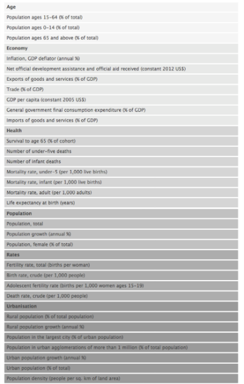
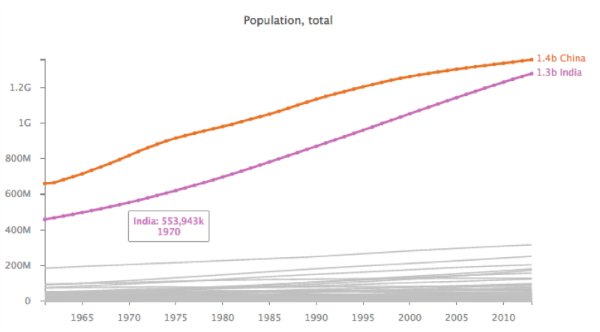
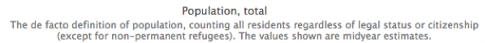
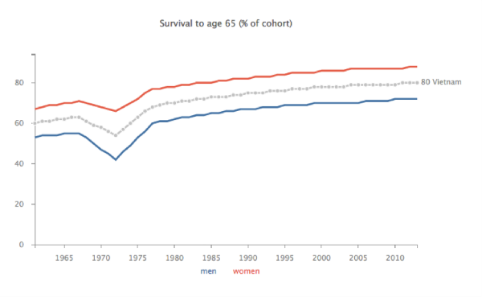
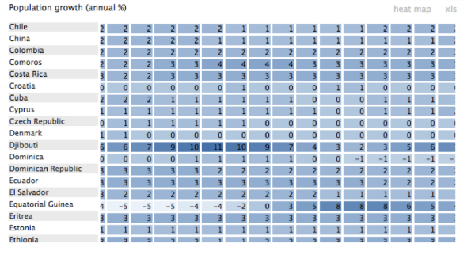

### The Chart builder

The *Chart builder* has been implemented as part of the [Worldbank Data Interface](http://larsvers.github.io/worldbank-data-interface/), which attempts to give a good overview of where the world has been heading in the past 50 years. 

--

It's a simple interface for users who would like to focus on a particular chart. There's a list of available metrics on the left hand side...

allowing the user to bring up the respective line chart on the right hand side. 

Click on the chart title to see a metric explanation:

Hover interaction and buttons above the chart allow for highlighting and line comparisons against the backdrop of the greyed out lines of all other categories (ie. countries in our case). 

The builder also allows for a split view in case we want to show for example values for men vs. women like so:

In addition to the line view, the users can switch to the data in table or heatmap form:

--

For the full worldbank data interface go [here](http://larsvers.github.io/worldbank-data-interface/)
